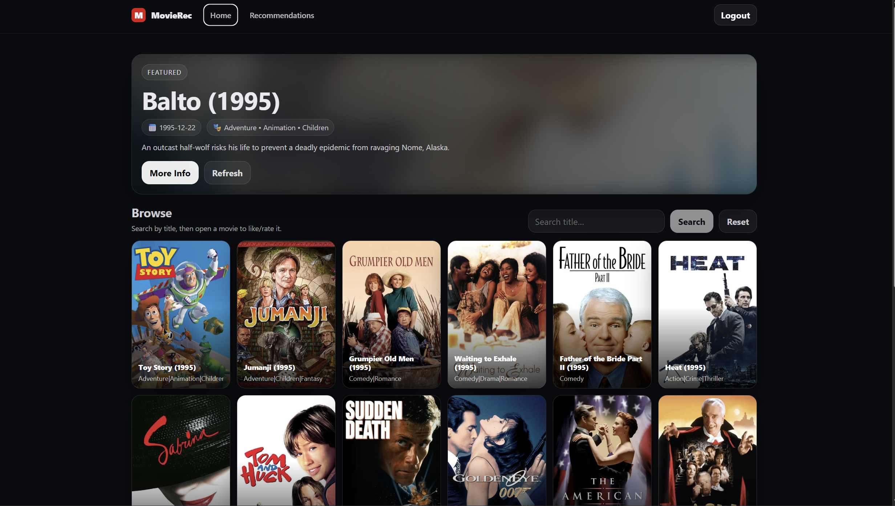
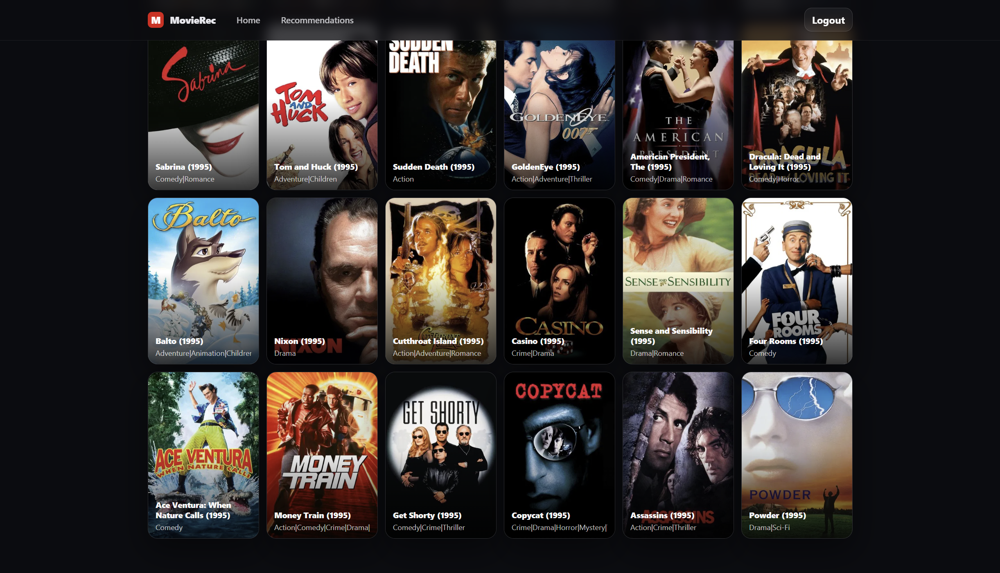
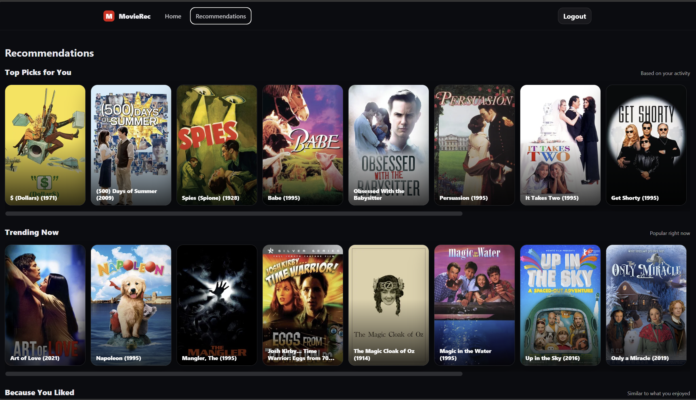
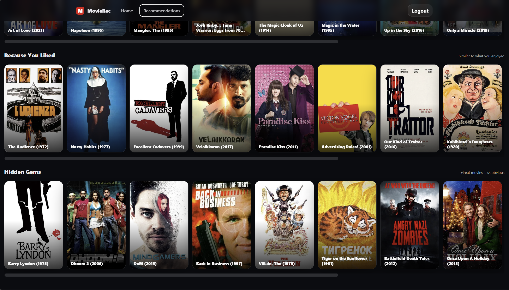
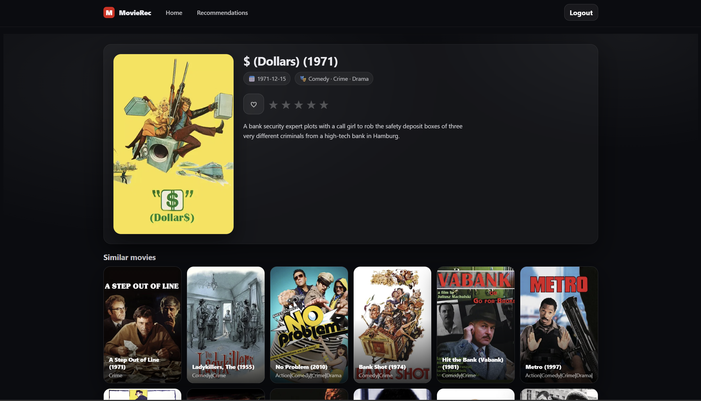
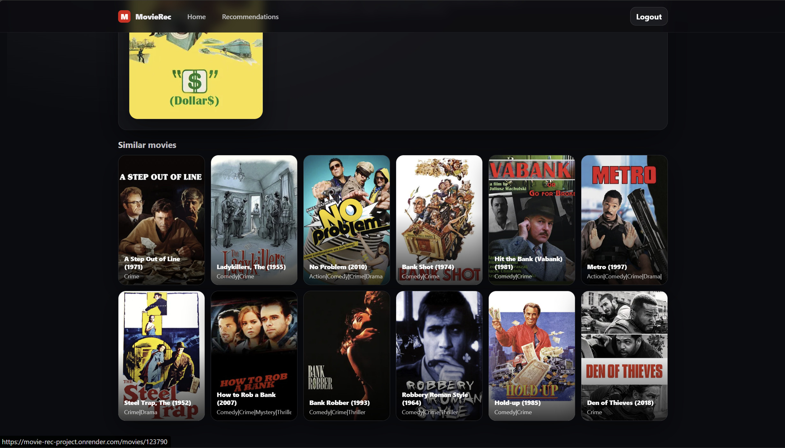
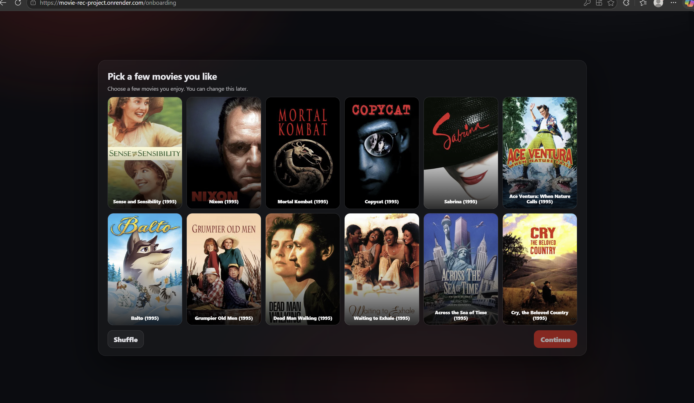

# 🎬 Hybrid Movie Recommendation System

## 📌 Overview

This project is a full-stack intelligent movie recommendation system that delivers personalized suggestions using a hybrid machine learning approach.

It combines:

* Collaborative Filtering (ALS)
* Content-Based Filtering (TF-IDF + SVD)
* Approximate Nearest Neighbors (HNSW)

The system is built with a modern web stack and deployed on cloud infrastructure with automated ML artifact management and background model updates.

---

## 🚀 Features

* 🔐 User authentication (JWT-based)
* ⭐ Likes and ratings system
* 🎯 Personalized recommendations
* 🔍 Content-based similarity search
* 📊 Hybrid recommendation engine
* 📦 ML artifact versioning and management
* 🔄 Background model refresh (every 5 minutes)
* 🌐 Fully deployed backend and frontend

---

## 🧠 How Recommendations Work

The system uses a **hybrid recommendation strategy**:

### 1. Collaborative Filtering (ALS)

* Learns user preferences from interactions (likes, ratings, views)
* Captures hidden patterns between users and movies

### 2. Content-Based Filtering

* Uses movie metadata (genres, titles)
* TF-IDF vectorization + dimensionality reduction (SVD)

### 3. HNSW Index

* Enables fast similarity search for content-based recommendations

### 4. Hybrid Scoring

* Combines ALS and content-based scores
* Dynamic weighting:

  * New users → more content-based
  * Active users → more collaborative filtering

### 5. Cold Start Handling

* New users receive trending or popular recommendations

---

## 📦 ML Artifact Management

* Models are versioned and stored in Cloudflare R2
* Each training run produces a new artifact version
* Backend automatically downloads the latest production artifacts
* Background process checks for updates every 5 minutes
* Enables **zero-downtime model updates**

---

## 🏗️ System Architecture

Frontend (React)
↓
Backend (FastAPI)
↓
PostgreSQL (Supabase)
↓
ML Artifacts (Cloudflare R2)

---

## ⚙️ Tech Stack

### Backend

* FastAPI
* SQLAlchemy
* PostgreSQL (Supabase)
* JWT Authentication

### Machine Learning

* implicit (ALS)
* scikit-learn (TF-IDF + SVD)
* hnswlib

### Frontend

* React
* React Router

### Cloud / Deployment

* Render (Backend)
* Supabase (Database)
* Cloudflare R2 (ML artifacts)
* Vercel / Netlify (Frontend)

---

## 🌍 Deployment

The system is deployed on cloud infrastructure using modern managed services:

* Backend hosted on Render
* Database powered by Supabase (PostgreSQL)
* ML artifacts stored and versioned using Cloudflare R2
* Frontend deployed via Vercel or Netlify

The backend includes a background process that periodically checks for updated ML artifacts and refreshes the live models without downtime.

---

## 📡 API Overview

### Auth

* POST /auth/register
* POST /auth/login

### Movies

* GET /movies
* GET /movies/{id}

### Recommendations

* GET /recommendations

### Interactions

* POST /likes
* POST /ratings

---

## 📸 Screenshots

### 🏠 Home Page

 



### 🎯 Recommendations Page





### 🎬 Movie Details Page





### 🧭 Onboarding




---

## 📁 Project Structure

```
backend/
  app/
  ml/
frontend/
docs/
```

---

## 🛠️ Local Setup

### Clone repository

```bash
git clone https://github.com/SherozMelikov/Movie_rec_project.git
cd Movie_rec_project
```

### Backend

```bash
cd backend
pip install -r requirements.txt
uvicorn app.main:app --reload
```

### Frontend

```bash
cd frontend
npm install
npm run dev
```

---

## 🔐 Environment Variables

### Backend

* `DATABASE_URL` – PostgreSQL connection string
* `SECRET_KEY` – JWT signing secret
* `ACCESS_TOKEN_EXPIRE_MINUTES` – token expiry time
* `R2_ACCESS_KEY` – Cloudflare R2 access key
* `R2_SECRET_KEY` – Cloudflare R2 secret key

### Frontend

* `VITE_API_BASE_URL` – backend API URL

---

## 🧪 Testing

The system was tested using:

* Unit testing with pytest
* Evaluation metrics:

  * HitRate@20
  * NDCG@20

These ensure correctness and quality of recommendations.

---

## 📌 Future Improvements

* Real-time recommendations
* Deep learning-based models
* Explainable recommendations
* A/B testing system

---

## 👨‍💻 Author

Final Year Computer Science Project

Sheroz Melikov 

